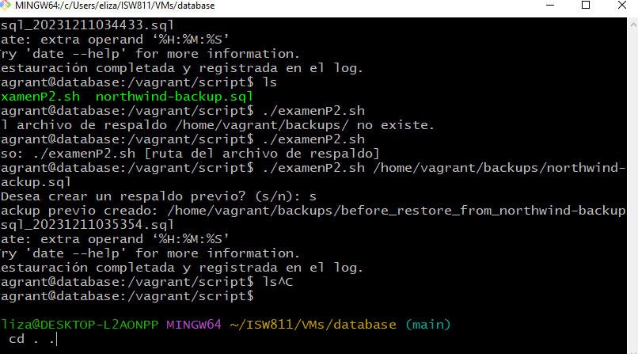
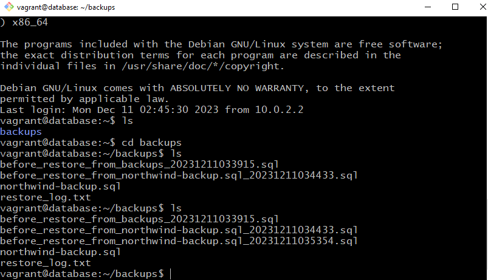

# Examen I , Parte Práctica 2

El examen se realizó dentro de la maquina virtual ´database´ creada anteriormente durante el curso, en la cual podemos encontrar un base de datos llamada northwind, implementada en el motor de base de datos MySQL con la cual haremos el ejercio práctico para el examen. 

## Comando Iniciales

´´´
vagrant up
vagrant ssh
cd /vagrant/script
touch examenP2.sh
code .
chmod +x examenP2.sh
./examenP2.sh 
´´´

## Cuando ya creamos el script para  ejecturlo pasando la ruta como parametro

```
./examenP2.sh /home/vagrant/backups/northwind-backup.sql
```
# Guía de Creación de Script de Bash para Restauración de Base de Datos

## Introducción
Esta guía explica cómo desarrollé un script de Bash que restaura una base de datos MySQL desde un archivo de respaldo. Además, el script registra cada restauración en un log y ofrece la opción de hacer un respaldo antes de la restauración.

## Pasos del Desarrollo

### Paso 1: Inicio del Script
El script comienza con `#!/bin/bash` que le dice al sistema que debe ejecutarlo con Bash.

### Paso 2: Verificar Argumentos
Primero, verifico si se ha proporcionado la ruta del archivo de respaldo como argumento:
```bash
if [ "$#" -ne 1 ]; then
    echo "Uso: $0 [ruta del archivo de respaldo]"
    exit 1
fi
```
Si no hay exactamente un argumento, el script se detiene.

### Paso 3: Configuración Interna
Defino variables para la configuración de la base de datos y las rutas de archivos:
```bash
DB_NAME="northwind"
DB_USER="north"
DB_PASS="secret"
LOG_FILE="/home/vagrant/backups/restore_log.txt"
BACKUP_FILE="$1"
```
Estas variables incluyen el nombre de la base de datos, usuario, contraseña, archivo de log y el archivo de respaldo.

### Paso 4: Función de Respaldo Previo
Creo una función que hace un respaldo antes de la restauración:
```bash
backup_before_restore() {
    local backup_file="/home/vagrant/backups/before_restore_from_$(basename $BACKUP_FILE)_$(date +%Y%m%d%H%M%S).sql"
    mysqldump -u $DB_USER -p$DB_PASS $DB_NAME > "$backup_file"
    echo "Backup previo creado: $backup_file"
}
```
Esta función genera un nombre de archivo con un timestamp para evitar sobrescrituras.

### Paso 5: Comprobar Archivo de Respaldo
Antes de restaurar, compruebo si el archivo de respaldo existe:
```bash
if [ ! -f "$BACKUP_FILE" ]; then
    echo "El archivo de respaldo $BACKUP_FILE no existe."
    exit 1
fi
```
Si no existe, el script se detiene.

### Paso 6: Opción de Respaldo Previo
Pregunto al usuario si quiere hacer un respaldo antes de restaurar:
```bash
read -p "¿Desea crear un respaldo previo? (s/n): " answer
if [ "$answer" = "s" ]; then
    backup_before_restore
fi
```

### Paso 7: Restauración de la Base de Datos
Luego, el script restaura la base de datos usando el archivo de respaldo:
```bash
mysql -u $DB_USER -p$DB_PASS $DB_NAME < "$BACKUP_FILE"
```

### Paso 8: Registro en Log
Por último, registro la restauración en el archivo de log:
```bash
echo "$(date +%Y-%m-%d %H:%M:%S) - Restauración realizada con el archivo $BACKUP_FILE" >> $LOG_FILE
echo "Restauración completada y registrada en el log."
```

## Conclusión
Con estos pasos, el script ofrece una solución detallada y funcional para la tarea de restaurar una base de datos MySQL, con funcionalidades adicionales para mayor utilidad y seguridad.

## Muestras de ejecución del codigo 






